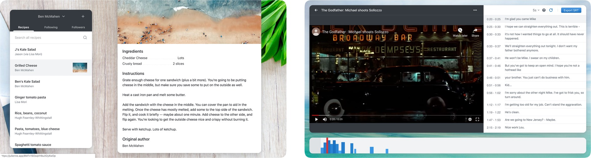
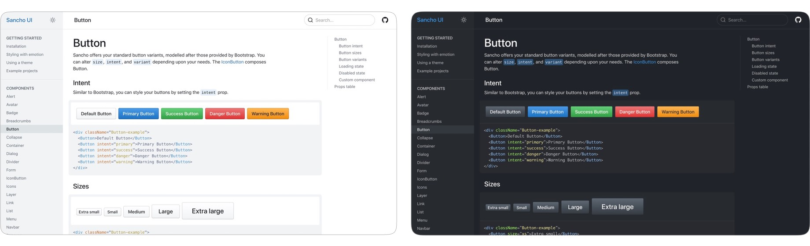

<p style='max-width: 32rem; text-align: center'>Sancho is an open source responsive and accessible design system built with React, Typescript and Emotion. View the <a href='http://sancho-ui.com'>documentation</a> or check the code on <a href='https://github.com/bmcmahen/sancho'>Github</a>.</p> 
<br />


#### Sancho aims to provide a beautiful, generic set of components that you can make your own.

The primary goal of Sancho's design is to provide a set of UI components which are beautiful and functional but generic enough to be used in most contexts, and extensible enough to be made your own.

I've found that many recent design systems are built with a particular project in mind with a unique, distinctive style, which makes it difficult to use without your project looking like an existing project. Something like Material-UI is really great, but its style is very much identifiable with the Google brand. Bootstrap has always struck me as different in this regard - it provides a beautiful, somewhat generic set of styles and components which work great out of the box but which can easily be altered. It feels like Bootstrap was made for you.

Sancho tries to replicate Bootstrap in this regard. Its design isn't particularly distinctive and it implements many of my favourite ideas from existing design systems. It's also meant to be extensible through a combination of theming variables and component composition techniques.

#### Responsive design is really hard. Sancho makes it easier.

For various reasons, many of the react based design systems don't make responsive design a priority. Sancho does its best to make mobile designs and touch interactions as good as possible. This comes out in some of the smaller details.

Sancho provides scroll locking in the appropriate context. Here's an example of scrolling within a `Sheet`.

<div class='video'>
<video autoplay="true" loop="true">
  <source type="video/mp4" src="./prevent-scroll-3.m4v"></source>
</video>
</div>

Sancho provides a responsive popover which acts as a regular popover on larger screens, but turns into a bottom sheet on mobile devices.

<div class='video'>
<video autoplay="true" loop="true">
  <source type="video/mp4" src="./responsive-popover.m4v"></source>
</video>
</div>

Sancho's tabs scroll into view on smaller screens.

<div class='video'>
<video autoplay="true" loop="true">
  <source type="video/mp4" src="./tabs-scroll.m4v"></source>
</video>
</div>

The goal is to ensure that Sancho looks and _feels_ as good on touch devices as it does on the desktop, a goal which is often surprisingly and frustratingly difficult to achieve.

#### Sancho has a dark mode.

Sancho provides a dark mode for all of its components which makes it relatively easy to build a dark and light mode version of your website.


<br />

But perhaps more importantly, dark and light mode can be utilized at the same time on different portions of your website. This makes it easy to build something like a navigation bar which has a dark background and light themed components and text.

```jsx
import { DarkMode } from 'sancho'

function App() {
  return (
    <div>
      <DarkMode>
        <NavigationBar />
      </DarkMode>
      <Container>
        <MainContent />
      </Container>
    </div>
  )
}
```

You can see this in action on the [toasted-notes](https://toasted-notes.netlify.com/) website which has a dark hero with light text. Even buttons are subtly altered to provide greater contrast on dark backgrounds.

#### Sancho is built with Typescript, Emotion and React.

Sancho is fully typed because it's built with Typescript. Even your theme is typed which ensures that you only access a value that exists on your theme object.

```jsx
/** @jsx jsx */
import { jsx } from '@emotion/core'
import { useTheme } from 'sancho'

function App() {
  const theme = useTheme()
  return (
    <div
      css={{
        background: theme.colors.background.tint1,
        fontSize: theme.sizes.giant, // typescript will tell you this doesn't exist
      }}
    >
      Hello world
    </div>
  )
}
```

I've found that using Emotion's `css` prop in combination with typescript's typing and VSCode's autocomplete largely renders a `Box` component or something like [styled-system](https://github.com/styled-system/styled-system) unnecessary. Emotion's `css` prop also makes it easy to compose styles and alter existing components.

```jsx
/** @jsx jsx */
import { jsx } from '@emotion/core'
import { Alert, useTheme } from 'sancho'

function MyCustomAlert() {
  const theme = useTheme()
  return (
    <Alert
      title="This Alert has an altered appearance"
      css={{
        maxWidth: '300px',
        '& .Alert__bar': {
          display: 'none',
        },
        '& .Alert__content': {
          padding: theme.spaces.sm,
        },
      }}
    />
  )
}
```

#### Sancho is tree shakable. Bundle only the components that you need.

It's unlikely that you'll need to use all of the components provided Sancho. Sancho is fully tree shakable which means that only those components that you use will be included in your final build.

If you import `Text` and `IconArrowRight` into a `create-react-app` bundled application, the final Sancho related build size is `8.4kb minified`.

#### We've provided two open source projects built with Sancho.

[Julienne.app](http://julienne.app) is a little app for sharing recipes with family and friends. View the [source](https://github.com/bmcmahen/julienne).


[Captioner.app](https://captioner.app/) provides a way to create subtitles for videos in your web browser. View the [source](https://github.com/bmcmahen/captioner).


#### Further resources

- [Sancho on Github](https://github.com/bmcmahen/sancho)
- [Sancho-UI Documentation](http://sancho-ui.com)
- [Julienne](http://julienne.app)
- [Captioner](http://captioner.app)
- [Toasted notes](https://toasted-notes.netlify.com/)
