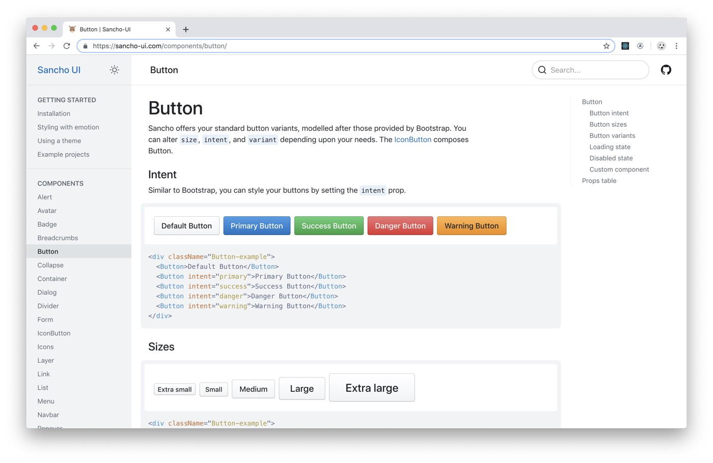
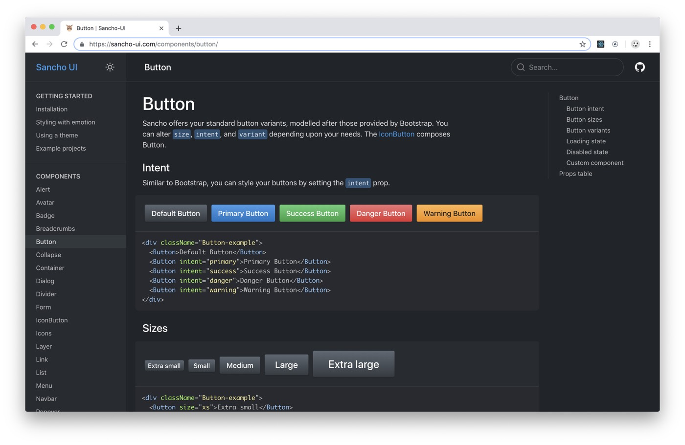
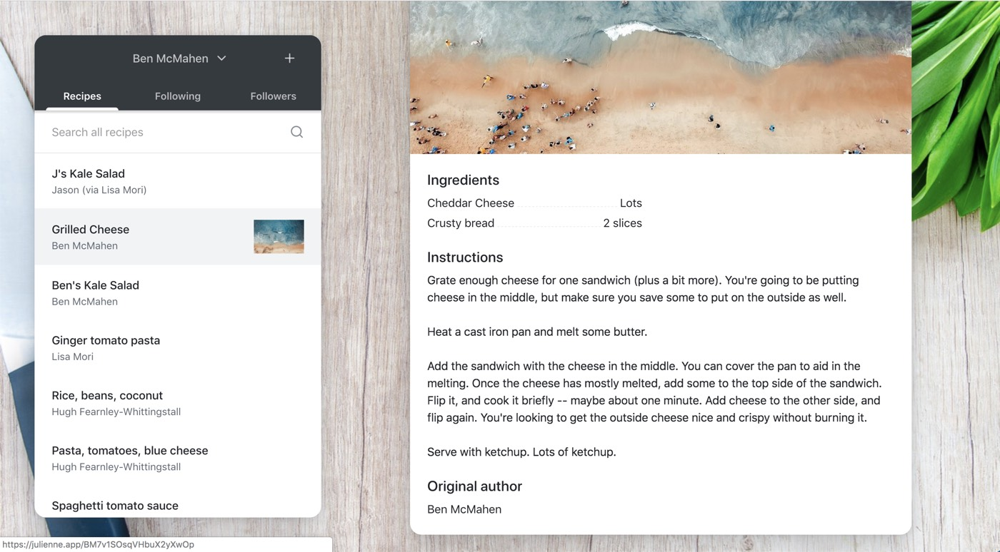
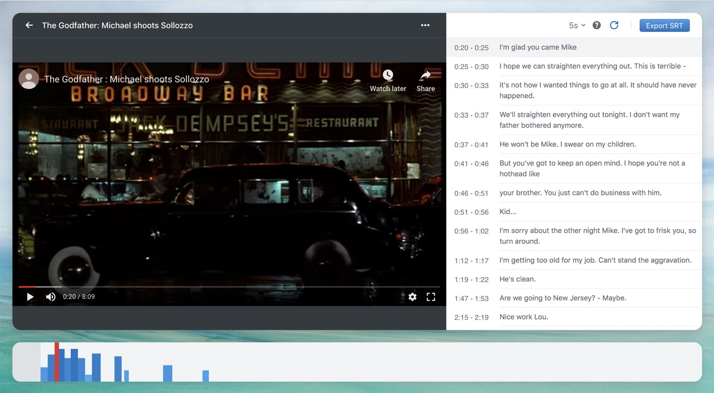

**TLDR**

**Sancho is a set of React UI components built to be responsive, accessible and beautiful. View the [documentation](http://sancho-ui.com) for details.**

---

I'd like to introduce Sancho, a set of React UI components built to help you bootstrap your React projects. It's named after my favourite fictional squire, Sancho Panza, from Don Quixote.

### Why another design system?

**Sancho aims to provide a beautiful, generic set of components that you can make your own.**

The primary goal of Sancho's design is to provide a set of UI components which are beautiful and functional but generic enough to be used in most contexts, and extensible enough to be made your own.

I've found that many recent design systems are built with a particular project in mind with a unique, distinctive style, which makes it difficult to use without your project looking like an existing project. Something like Material-UI is really great, but its style is very much identifiable with the Google brand. Bootstrap has always struck me as different in this regard - it provides a beautiful, somewhat generic set of styles and components which work great out of the box but which can easily be altered. In this sense, it feels like Bootstrap is made for you.

Sancho tries to replicate Bootstrap in this regard. It's design isn't particularly distinctive and it implements many of my favourite ideas from existing design systems. It's also meant to be extensible through a combination of theming variables and component composition techniques.

**Responsive design is hard. Sancho tries to make it easier**

For various reasons, many of the react based design systems don't make responsive design a priority. Sancho does it's best to make mobile designs and touch interactions as good as possible. This comes out in some of the smaller details:

Sancho provides scroll locking in the appropriate contexts. Here's an example of scrolling within a `Sheet`.

<video autoplay="true" loop="true">
  <source type="video/mp4" src="./prevent-scroll.m4v"></source>
</video>

Sancho provides a responsive popover which acts as a regular popover on larger screens, but turns into a bottom sheet on mobile devices.

<video autoplay="true" loop="true">
  <source type="video/mp4" src="./responsive-popover.m4v"></source>
</video>

This one is shamelessly borrowed from Google. Sancho's tabs scroll into view on smaller screens.

<video autoplay="true" loop="true">
  <source type="video/mp4" src="./tab-slide-animated-content.m4v"></source>
</video>

The goal is to ensure that Sancho looks and _feels_ as good on touch devices as it does on the desktop, a goal which is often surprisingly and frustratingly difficult to achieve.

3. Sancho has a dark mode

Sancho provides a dark mode for all of its components which makes it relatively easy to build a dark and light mode themed version of your website.





But perhaps more importantly, dark and light mode can be utilized at the same time on different portions of your website. This makes it easy to convert a navbar with a dark background to have light themed components.

```jsx
import { DarkMode } from 'sancho'

function App() {
  return (
    <div>
      <DarkMode>
        <NavigationBar />
      </DarkMode>
      <Container>
        <MainContent />
      </Container>
    </div>
  )
}
```

I make use of this on the [toasted-notes](https://toasted-notes.netlify.com/) website which has a dark hero with light text. Even buttons are subtly altered to provide greater contrast on dark backgrounds.

4. Sancho is built with Typescript and Emotion

With Typescript, Sancho provides full type annotations. This is especially useful when it comes to theming because it means that you can be sure that you are accessing a value that exists on your theme object.

```jsx
/** @jsx jsx */
import { jsx } from '@emotion/core'
import { useTheme } from 'sancho'

function App() {
  const theme = useTheme()
  return (
    <div
      css={{
        background: theme.colors.background.tint1,
      }}
    >
      Hello world
    </div>
  )
}
```

With Emotion, we have the full power of the `css` prop and the ability to compose styles. This means we can easily alter the style of existing components.

```jsx
/** @jsx jsx */
import { jsx } from '@emotion/core'
import { Alert, useTheme } from 'sancho'

function MyCustomAlert() {
  const theme = useTheme()
  return (
    <Alert
      title="This Alert has an altered appearance"
      css={{
        maxWidth: '300px',
        '& .Alert__bar': {
          display: 'none',
        },
        '& .Alert__content': {
          padding: theme.spaces.sm,
        },
      }}
    />
  )
}
```

5. Include only those components that you use.

It's unlikely that you'll need to use all of the components provided Sancho or it's unlikely that you'll want to import the entire component collection in your initial bundle. Sancho is fully tree shakable which means that only those components that you import will be included in your final build.

If we import `Text` and `IconArrowRight` into a `create-react-app` bundled application, our final build size is 8.4kb minified.

## Two example applications, open sourced

Lastly, I've also open sourced two little side-projects both built with Sancho.

The first is called Julienne, and it's a little app for sharing recipes with family and friends.



The second is called Captioner, and it's a way to create subtitles for videos in your web browser.



I hope these will give users a sense of what Sancho apps can look like. And I hope they will be instructive to people wanting to learn how to build React applications.

## Further resources

- [Sancho on Github](https://github.com/bmcmahen/sancho)
- [Sancho-UI Documentation](http://sancho-ui.com)
- [Julienne](http://julienne.app)
- [Captioner](http://captioner.app)
- [Toasted notes](https://toasted-notes.netlify.com/)
