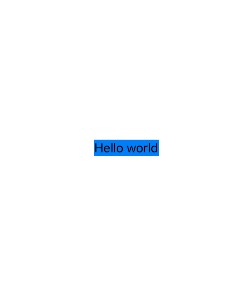
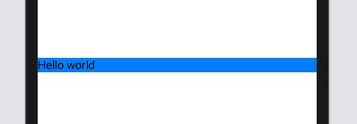
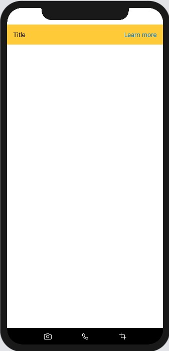
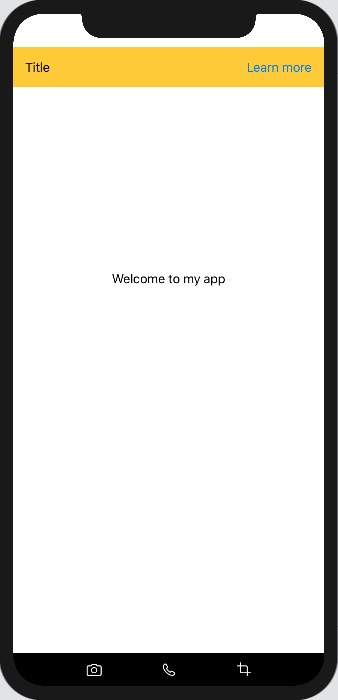

If you're coming from a web background like me, the SwiftUI primitives for handling layouts will seem rather... primitive. Really, you have `HStack`, `VStack`, `Spacer` and not much more. Using `Spacer` might even remind you of hacking layouts together using `br` tags in html.

But it's a testament to SwiftUI's design that so much can be accomplished with these three views. Let's explore how to combine them to create differrent layouts.

#### Basic usage of Spacer

The first thing to remember is that Views define their own size and, by default, are only as big as necessary. This is a bit of a shift if you come from a web background. Consider the following html and css:

```html
<div style="background: blue"><span>Hello</span></div>
```

Our `div`, a block element, will typically extend to fill the full horizontal width available to it. This will potentially change depending upon the parent it's wrapped in (if you're using flexbox, for example).

Let's compare this to a basic SwiftUI layout:

```swift
HStack {
    Text("Hello")
}.background(Color.blue)
```



The blue background is only as wide as our text. We can change this by adding a `Spacer` to our `HStack`.

```swift
HStack {
    Text("Hello world")
    Spacer()
}.background(Color.blue)
```



This gives us the equivalent of the html example. We have left aligned text, and our blue background extends horizontally to the full width available to it.

#### A more complex example

We can combine these three Views to create increasingly complex layouts. Consider this more complex example:



```swift
VStack {
    HStack {
        Text("Title")
        Spacer()
        Button(action: onPress) {
            Text("Learn more")
        }
    }
        .padding()
        .background(Color.gray)

    Spacer()

    HStack {
        Spacer()
        Image(systemName: "camera")
        Spacer()
        Image(systemName: "phone")
        Spacer()
        Image(systemName: "crop")
        Spacer()
    }
        .padding()
        .background(Color.gray)
}
```

We've created a top aligned title bar and a bottom aligned tab bar which is achieved by adding a `Spacer` between the two `HStack` views. We achieve evenly spaced tab icons on the bottom of our layout by placing a `Spacer` between each icon.

Let's add some content to this layout. I want the content to appear about 2/3rds of the way up.



```swift
 VStack {
    HStack {
        Text("Title")
        Spacer()
        Button(action: onPress) {
            Text("Learn more")
        }
    }
        .padding()
        .background(Color.yellow)

    Spacer()
    Text("Welcome to my app")
    Spacer()
    Spacer()

    HStack {
        Spacer()
        Image(systemName: "camera")
        Spacer()
        Image(systemName: "phone")
        Spacer()
        Image(systemName: "crop")
        Spacer()
    }
        .padding()
        .foregroundColor(Color.white)
        .background(Color.black)
}
```

I think it's rare that you'd actually use this many spacer views in most layouts, but it gives you a sense of its power. Instead of relying on fixed frame sizes, I'd often recommend using `Spacer` instead to achieve more flexible and responsive components.

**Further links**

- **[react-meets-swiftui layouts](https://github.com/bmcmahen/react-meets-swiftui/blob/master/Layouts/Layouts.md)** - Additional resources for understanding layouts when coming from a React or web background.
